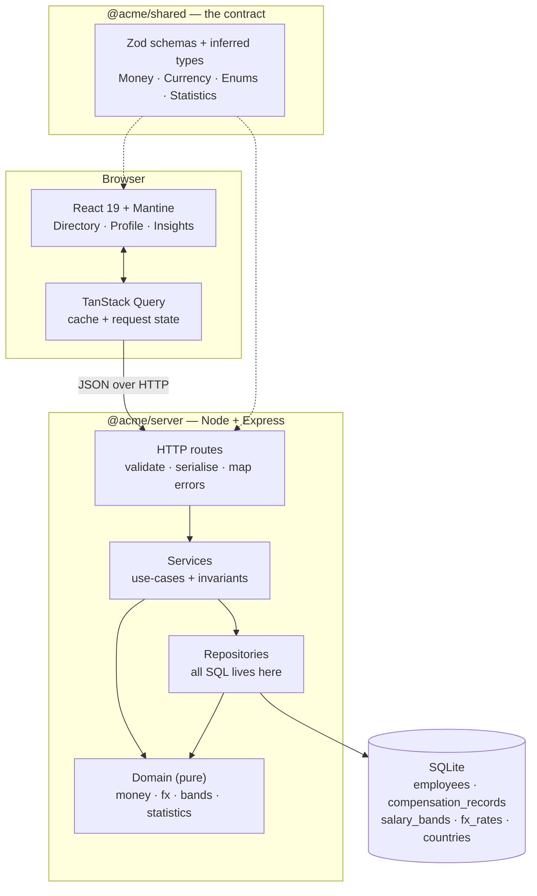
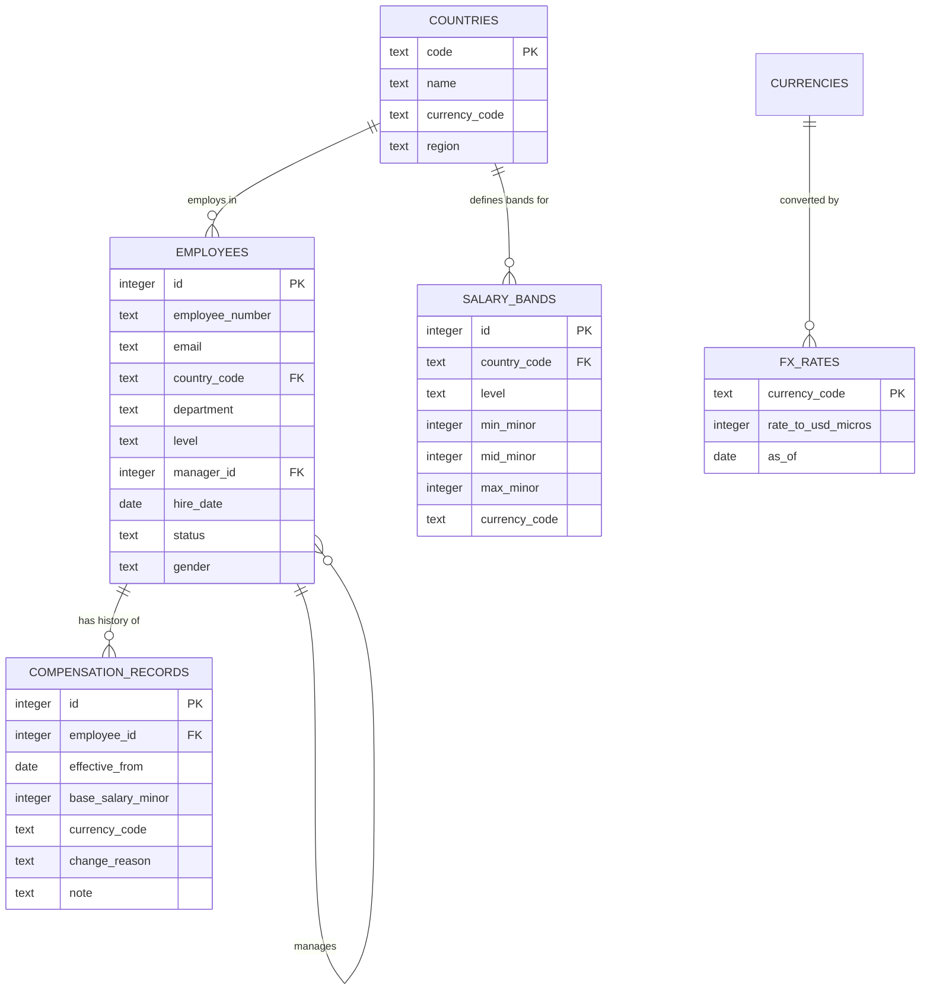

# Architecture

## 1. Shape of the system

One TypeScript monorepo, three packages, one deployable process.



**Why the shared package exists.** The request/response shape of every endpoint is declared once as a
Zod schema in `@acme/shared`. The server validates against it; the web client infers its types from
it. A field renamed on the server is a compile error in the UI, not a runtime surprise. This is the
single highest-leverage structural decision in the repo for a TypeScript codebase.

## 2. Layering rules

| Layer | May depend on | Contains | Tested by |
|---|---|---|---|
| `http/routes` | services, shared | Parsing, status codes, error mapping. No SQL, no arithmetic. | Supertest API tests |
| `services` | repositories, domain | Use-cases and invariants ("a raise must be in the employee's currency") | API + service tests |
| `repositories` | db, domain | **Every SQL statement in the codebase** | Integration tests on in-memory SQLite |
| `domain` | shared | Pure functions: money, FX, compa-ratio, percentiles | Fast unit tests |

The dependency arrow never reverses. `domain` knows nothing about HTTP or SQL, which is why it is
trivial to test and why the interesting rules are the easiest code in the repo to read.

## 3. Data model



Three modelling decisions carry the whole design:

1. **Compensation is effective-dated and append-only.** An employee has no `salary` column. Their
   salary is *the most recent compensation record whose `effective_from` is on or before the date you
   are asking about*. This is how compensation actually works, and it means "what did we pay last
   January?" is a query, not a lost fact. See ADR-0004.
2. **Money is integer minor units.** `base_salary_minor = 8_500_000` is ₹85,000.00. Never a float.
   See ADR-0003.
3. **Cross-country comparison goes through a dated FX table.** A median that mixes INR and EUR is a
   meaningless number; every aggregate is computed on a USD-normalised amount. See ADR-0006.

## 4. The `current_compensation` view

Resolving "latest record on or before today" for 10,000 employees on every request would be the
system's performance cliff. It is solved once, in SQL, as a view backed by a covering index:

```sql
CREATE VIEW current_compensation AS
SELECT employee_id, effective_from, base_salary_minor, currency_code, ...
FROM (
  SELECT *, ROW_NUMBER() OVER (
             PARTITION BY employee_id ORDER BY effective_from DESC, id DESC
           ) AS rn
  FROM compensation_records
  WHERE effective_from <= DATE('now')
) WHERE rn = 1;
```

Every read path — directory, profile, analytics, export — goes through this view, so "current
salary" has exactly one definition in the system. See `docs/performance.md` for the measured cost.

## 5. Request path, end to end

Listing engineers in Germany, sorted by salary:

1. `GET /api/employees?country=DE&department=Engineering&sort=salary_desc&page=1`
2. Route parses the query string with the shared Zod schema — unknown or malformed params are a 400
   before anything touches the database.
3. `EmployeeService.list()` asks `EmployeeRepository.search()`.
4. One SQL statement joins `employees` → `current_compensation` → `fx_rates` → `salary_bands`,
   filters, sorts on the USD-normalised amount, and returns one page plus a total count.
5. Rows are mapped to the shared response type; money is serialised as `{ amountMinor, currency }`,
   never as a formatted string — formatting is a presentation concern.

Pagination, sorting, filtering and aggregation are all done by SQLite. The server never loads 10,000
rows into memory, and neither does the browser.

## 6. Testing strategy

| Kind | Where | Runs against | Speed |
|---|---|---|---|
| Unit | `domain/`, `shared/` | Nothing — pure functions | instant |
| Integration | `repositories/`, analytics SQL | `:memory:` SQLite + a **12-employee hand-written fixture** whose medians are obvious on sight | fast |
| API | `http/` | Supertest + in-memory DB | fast |
| Component | `web/` | Testing Library + jsdom, network mocked at the fetch boundary | fast |

The integration fixture is deliberately tiny and hand-built. When a test asserts *"the median
Engineering salary in the US is $150,000"*, you can verify that by reading the fixture, which is the
difference between a test that documents behaviour and a test that merely detects change.

## 7. What I would do next

1. Authentication + RBAC (the one seam left open on purpose).
2. Bulk CSV import with dry-run and a diff review screen — the real migration off Excel.
3. Move to Postgres when concurrent writers appear; the repository boundary makes this mechanical.
4. Bonus/equity as additional typed compensation components.
